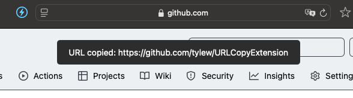

# URLCopyExtension - Safari Web Extension
February 2025

## 📌 Overview
**URLCopyExtension** is a **Safari Web Extension** that allows users to quickly copy the **current webpage URL** using the keyboard shortcut **Cmd + Shift + C**. When triggered, the extension:
1. **Copies the URL** to the clipboard.
2. **Displays a toast notification** confirming the copy action.


## 🚀 Features
- ✅ **Clipboard Shortcut** - Press `Cmd + Shift + C` to copy the URL instantly.
- ✅ **Visual Feedback** - A toast notification appears when the URL is copied.
- ✅ **Lightweight & Fast** - Lightweight Javascript with relatively zero impact on performance.
- ✅ **Safari Native Integration** - Works directly inside Safari as an extension.




## 🛠 Installation

### 1️⃣ **Run in Xcode**
1. Clone this repository:

```sh
git clone https://github.com/tylew/URLCopyExtension.git
cd URLCopyExtension
```

2.	Open the project in Xcode:

```sh
open URLCopyExtension.xcodeproj
```

3.	Select the Safari Web Extension Target and click Run (Cmd + R).

### 2️⃣ Enable in Safari
1.	Open Safari → Settings (Cmd + ,).
2.	Go to Extensions and enable URLCopyExtension.

❗️ If the extension doesn't show, you probably need to enable **Allow unsigned extensions** in **Safari Developer settings**

## 🔑 Usage
-	Press Cmd + Shift + C → The URL is copied to the clipboard.
-	A toast message confirms the copy.

## 🔧 Development & Debugging
-	Modify content.js to change how the extension interacts with Safari.
-	Modify manifest.json or Info.plist to adjust permissions.
-	Use console.log() to debug inside Safari Web Inspector.

## 🤝 Contributing

Pull requests are welcome.


## 📜 License

MIT License © 2025 Tyler Lewis
