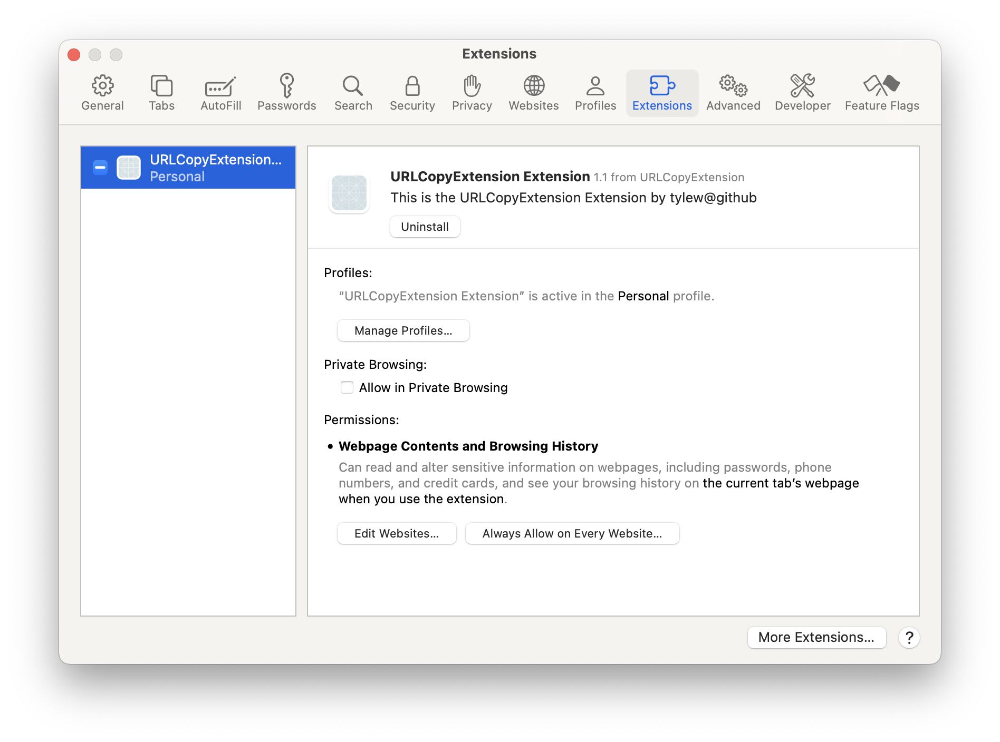

# URLCopyExtension - Safari Web Extension
📅 February 2025

## 📌 Overview
URLCopyExtension is a lightweight Safari Web Extension that allows users to quickly copy the current webpage URL with the keyboard shortcut Cmd + Shift + C.


## 🚀 Key Features
- ✅ Overrides Safari’s default Cmd + Shift + C behavior (opens console when dev tools enabled).
- ✅ Copies the URL to the clipboard instantly.
- ✅ Shows a toast notification for confirmation.
- ✅ Injects only when needed (at command time), ensuring minimal impact on performance or security concerns.
- ✅ Leverages a shadow DOM to improve performance and avoid unintended overwrites.


## 🛠 Installation

### 1️⃣ **Clone and Open in Xcode**

```sh
git clone https://github.com/tylew/URLCopyExtension.git
cd URLCopyExtension
open URLCopyExtension.xcodeproj
```

### 2️⃣ Run the Extension
1.	Select the Safari Web Extension Target in Xcode.
2.	Click Run (Cmd + R).

### 3️⃣ Enable in Safari
1.	Open Safari → Settings (Cmd + ,).
2.	Go to Extensions and enable URLCopyExtension.



### ❗ If the extension doesn’t appear:
- Enable “Allow unsigned extensions” in Safari Developer Settings.
- Restart Safari.

## 🔑 Usage

### 🚀 Copying the URL:
-	Press Cmd + Shift + C → The URL is copied to the clipboard.
-	A toast notification confirms the copy.

---

## 🔧 Development & Debugging
-	Modify content.js to change how the extension interacts with Safari.
-	Modify manifest.json or Info.plist to adjust permissions.
-	Use console.log() to debug inside Safari Web Inspector.

## 🤝 Contributing

Pull requests are welcome.


## 📜 License

MIT License © 2025 Tyler Lewis
